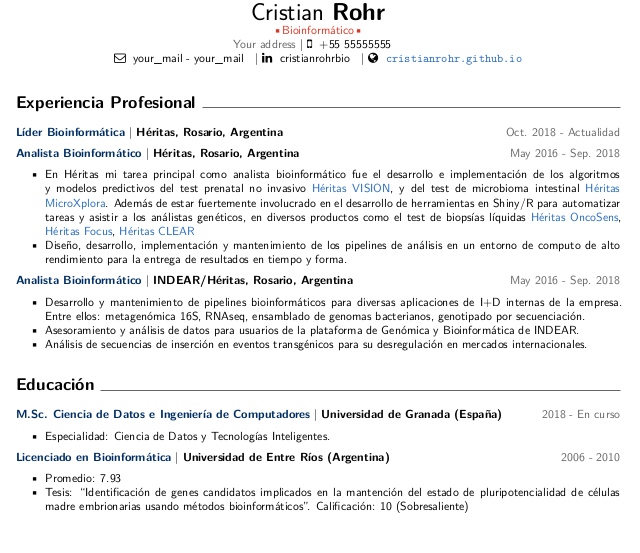

# RMarkdown resume/CV template

Based on [isteves](https://github.com/isteves/resume) template, previously bases on templates by [svmiller](https://github.com/svmiller/svm-r-markdown-templates) and [ryanpeek](https://github.com/ryanpeek/markdown_cv). I changed the font to Helvetica Neu, and added new styles in the `cv-template.tex` file. The document is written in markdown and latex.

## Instructions
Modify the yaml header `cv-template.Rmd` to match your personal data. Edit the resume data in the markdown body. 

Latex styles are in `cv-template.tex`.

